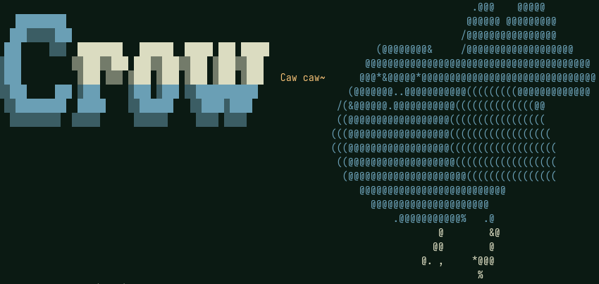

Hyla-lang
=========



This project is me experimenting with creating my own programming language.
For this project I am using C++23.

Hyla's syntax is somewhat inspired by Swift, Golang and Rust.
But in Hyla expressions are not statements.
This allows us to write code without any need for semicolons.

The main goal of the programming language is having seamless interoperability with other programming languages.
Besides being able to select which backend you want to use for code generation:
 + LLVM (being refactored to be generated by IR).
 + C++ (Generated from the AST).
 + C (not yet implemented)

It is also possible to select for which languages you want interoperability:
 + Python (Works for C++ backend uses `pybind11`)
 + Lua (not yet implemented)
 + JavaScript (not yet implemented)

Here is a simple sample program.
```go
module main

// Standard library includes:
#include_once <core/core.cw>

func main() -> int {
  defer {
    println("Defer!")
  }

  println("Hello World!")
}
```

Which can be compiled using:
```shell
crow --backend cpp --interop python samples/hello.cw
```
Which will create an importable Python DLL.

Or here is a simple example using C interop.
```go
module main

// Define a forward declaration for the libc abs function.
[[extern("C")]] {
  declare func abs(t_x: int) -> int
}

func main() -> int {
  let num = abs(-23)

  println("Absolute value of -23 => {}", num)

  return 0
}
```

Compile using:
```shell
crow --backend cpp samples/attribute.cw
```

This will generate a DLL which can be directly imported from Python.

## Warning
Note that the project is not yet stable at all.
And a lot of things are not working yet or feature complete.

Here is a list of the following, which is implemented:
 1. Lexer.
 2. Top down LR parser.
 3. Pratt parser (handles operator precedence when parsing).
 4. Semantic validation (type inference, type checking, type promotion, symbol table generation).
 5. IR generation (currently being worked on).
 6. LLVM backend (partially implemented).
 7. C++ backend (fully implemented and generates from AST).
 8. C++ backend - Python interop.
 9. Compiler flag configuration via CLI and TOML file (`crow.toml`).
 10. Variables are implemented (`let` and `var` for constants and normal variables respectively).
 11. Arithmetic is implemented.
 12. Loops are implemented.
 13. Calling functions (and the standard library functions `print` and `println`).
 14. Serializing AST and deserializing AST (important for when implementing parallel compilation of multiple translation units, to prevent memory overhead).
 15. Logging infrastructure is in place.
 16. Visitor pattern used for, semantic analysis, serializing, printing, code generation, IR generation, etc.


## Dependencies
In order to compile the project you will need to following dependencies:

- C++ compiler with support for C++23.
- [Invoke](https://www.pyinvoke.org/) (Used to invoke CMake and scripts)
- [Cmake](https://cmake.org/)  (Main buildsysstem)
- [CLI11](https://github.com/CLIUtils/CLI11) (CLI option parsing library)
- [rang](https://github.com/agauniyal/rang/tree/master) (cross platform terminal coloring library)
- [tabulate](https://github.com/p-ranav/tabulate) (Text table library)
- [Boost](https://www.boost.org/) (Utility libraries for C++)
- [LLVM](https://llvm.org) (LLVM is used for code generation and optimization)
- [cereal](https://uscilab.github.io/cereal/) (Serialization library used for the AST)
- [libassert](https://github.com/jeremy-rifkin/libassert) (Modern assertion library for compile and runtime assertion checking)
- [pybind11](https://github.com/pybind/pybind11) (Used to generate C++ to Python bindings.)

### Buildsystem
In order to compile the project you will need a couple of dependencies.
First we use invoke to invoke different python scripts, to orchestrate building the project.
In order to install invoke it is best to use pipx.
Which is installed using:
```shell
apt install -y pipx
```

In order to make use of invoke you should install it through `pipx`.
```shell
pipx install invoke
```

The you can invoke the appropriate setup script for your OS by running:
```shell
inv setup
```

If your OS is not supported it is best to checkout `tools/setup` and figure out what dependencies you require.

### Build
After installing the necessary dependencies you can build the compiler by running:
```
inv build --parallel
```

## Project documentation

 - `assets/`: Non code related assets like images.
 - `cmake/`: Cmake sources that are needed to build the project.
 - `src/`: Sources of the Crow project.
 - `tests/`: Unit tests of the Crow project.
 - `samples/`: Crow sources that can be compiled to demonstrate the functionalities of Crow.
 - `tools/`: Collection of tools and scripts, that aid development.
